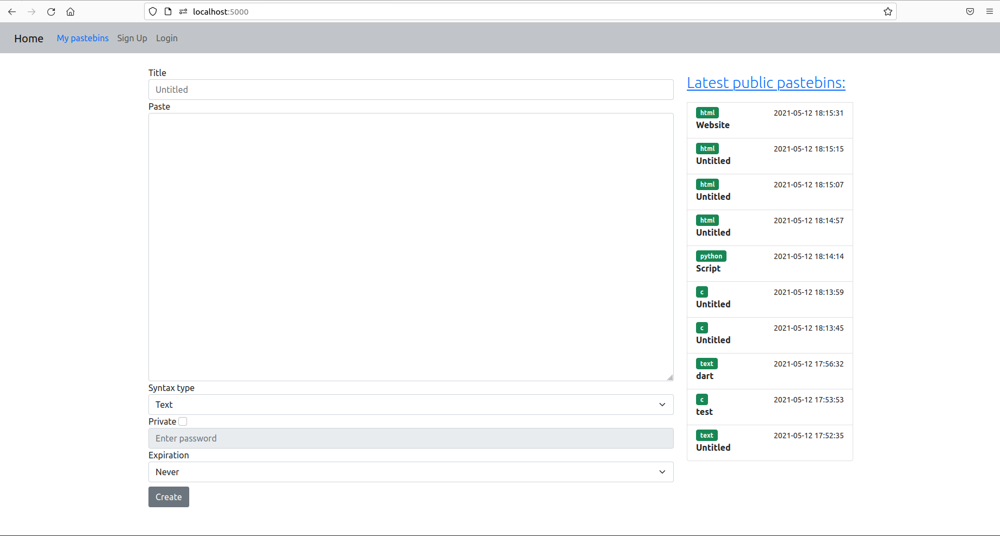

## Tabla de contenidos 

- [Presentación del proyecto](https://prezi.com/view/LxfVhoXc9qN5OqnNOFOe/)

- [Objetivo del proyecto](#Objetivo-del-proyecto)

- [Explicación de la aplicación Flask](#Explicación-de-la-aplicación-flask)

- [Organización del proyecto](#Organización-del-proyecto)

- [Ejecución del proyecto](./README_exec.md)

- [Posibles mejoras](#Posibles-mejoras)

## Objetivo del proyecto 

Partiendo de una aplicacion Python Flask que contiene tests, hemos incluido las siguientes modificaciones:

1. Generar métricas.
2. Dockerizar.
3. Desplegar en la nube de `AWS` y almacenar un backup de la aplicación en `S3`.
4. Aplicar `CI/CD` mediante `GitHub Actions`.
5. Monitorizar mediante `Prometheus` y `Grafana`.
6. Automatizar todo el proceso, mediante scripts en `bash`, para un despliegue sencillo.

## Explicación de la aplicación Flask

Se dispone de una aplicación `Python Flask` que consiste en gestionar `pastebins`.

Un `pastebin` es una aplicación web que permite a sus usuarios subir pequeños textos, generalmente ejemplos de código fuente, para que estén visibles al público en general.

:information_source:Debido a que el objetivo del proyecto no es entender el funcionamiento de la aplicación en profundidad, no nos extenderemos en este documento. No obstante, dispone de más información sobre la aplicación [aquí](./flask-pastebin/README_APP.md)

## Organización del proyecto

Hemos estructurado el proyecto de la siguiente manera: 

- `/.github/workflows` ➢ Directorio que contiene los ficheros `.yaml` necesarios para implementar CI/CD mediante GitHub Actions.

- `/flask-pastebin` ➢ Directorio que contiene la aplicación Python Flask pastebin y ficheros adicionales para dockerizarla y monitorizarla.

- `/scripts` ➢ Directorio que contiene ficheros bash de automatización para realizar los despliegues de forma sencilla.

- `/terraform` ➢ Directorio que contiene ficheros `.tf` para disponer de un backup de la aplicación en la nube de AWS.

- `.gitignore` ➢ Fichero de texto para que `Git` no suba ficheros innecesarios.

- `README.md` ➢ Fichero de texto que contiene la explicación general de todo el proyecto.

- `README_exec.md` ➢ Fichero de texto que contiene la explicación para la ejecución del proyecto.

- `/capturas` ➢ Directorio que contiene las imágenes utilizadas para ilustrar el proyecto.

### Contenido de la carpeta .github/workflows

Dentro de la carpeta `.github/workflows`, nos encontraremos con el siguiente contenido que aplica CI/CD a través de GitHub Actions: 

- [docker.yaml](.github/workflows/docker.yaml) ➢ Fichero que construye y sube una imagen a DockerHub.

- [elasticbeanstalk.yaml](.github/workflows/elasticbeanstalk.yaml) ➢ Fichero que despliega nuestra aplicación Python Flask en la nube de AWS.

- [terraform.yaml](.github/workflows/terraform.yaml) ➢ Fichero que genera un Bucket S3 en AWS y almacena un backup de nuestra aplicación.

- [test.yaml](.github/workflows/test.yaml) ➢ Fichero que instala las dependencias de Python y ejecuta los tests.

- [delete.yaml](.github/workflows/delete.yaml) ➢ Fichero que elimina la aplicación y recursos generados en la nube de AWS, así como el backup de esta.

### Contenido de la carpeta /flask-pastebin

Dentro de la carpeta `/flask-pastebin`,  nos encontraremos con el siguiente contenido:

:information_source:Debido a la cantidad de ficheros que existen dentro de este directorio procedemos a explicar los más relevantes: 

- [Dockerfile](flask-pastebin/Dockerfile) ➢ Fichero que contiene todos los comandos necesarios para crear una imagen Docker de nuestra aplicación Flask.

- [docker-compose.yaml](flask-pastebin/docker-compose.yaml) ➢ Fichero que define y ejecuta los siguientes contenedores:

    1. Flask-pastebin_app
    2. Prometheus
    3. Alertmanager
    4. Grafana

- [.env](flask-pastebin/.env) ➢ Fichero que contiene las variables de entorno utilizadas en nuestro docker-compose.

- [Prometheus](flask-pastebin/prometheus) ➢ Directorio en el que nos encontramos los siguientes ficheros:

    1. [prometheus.yaml](flask-pastebin/prometheus/prometheus.yaml): Configuración general de Prometheus
    2. [prometheus_rules.yaml](flask-pastebin/prometheus/prometheus_rules.yaml): Configuración de alertas de uso de CPU y memoria.

- [Alertmanager](flask-pastebin/alertmanager) ➢ Directorio en el que se encuentra el fichero [config.yaml](flask-pastebin/prometheus/config.yaml) utilizado para configurar alertmanager. En él, enviamos las alertas configuradas a Slack.

- [Grafana](flask-pastebin/grafana) ➢ Directorio en el que se encuentra el fichero [custom_dashboard.json](flask-pastebin/prometheus/custom_dashboard.json) utilizado para configurar el panel de Grafana.

### Contenido de la carpeta /scripts

Dentro de la carpeta `/scripts`, nos encontraremos con los siguientes ficheros bash de automatización:

- [autodeploy_aws_app.sh](scripts/autodeploy_aws_app.sh) ➢ Script para automatizar el proceso de despliegue de la aplicación en AWS.

- [autodeploy_backup_s3.sh](scripts/autodeploy_backup_s3.sh) ➢ Script para automatizar el almacenamiento del backup de la aplicación a AWS S3 mediante Terraform.

- [autodeploy_docker.sh](scripts/autodeploy_docker.sh) ➢ Script para automatizar el proceso de creación de la aplicación mediante Docker.

- [autodeploy_all.sh](scripts/autodeploy_all.sh) ➢ Script para ejecutar todos los autodeploy anteriores.

- [autodelete_all.sh](scripts/autodelete_all.sh) ➢ Script para liberar los recursos generados por los autodeploy anteriores.

### Contenido de la carpeta /terraform

Dentro de la carpeta `/terraform`, nos encontraremos con los siguientes ficheros para su correcta configuración:

- [main.tf](terraform/main.tf) ➢ Contiene los parámetros necesarios para la creación del Bucket S3.

- [outputs.tf](terraform/outputs.tf) ➢ Contiene los parámetros necesarios para la devolución por consola del nombre del bucket generado por AWS.

- [providers.tf](terraform/providers.tf) ➢ Contiene los parámetros necesarios para configurar el proveedor y la región donde se desplegará el bucket.

- [variables.tf](terraform/variables.tf) ➢ Contiene las variables necesarias para la configuración del bucket.

### Contenido de la carpeta /K8s

Dentro de la carpeta `/K8s`,  nos encontraremos con el siguiente contenido:

:information_source:Debido a la cantidad de ficheros que existen dentro de este directorio procedemos a explicar los más relevantes:

- Ficheros y directorios necesarios para Flask Pastebin anteriormente especificados.

- Ficheros necesarios para desplegar la `aplicación`:

    - [ingress.yaml](K8s/ingress.yaml) ➢ Contiene la configuración necesaria para manejar el tráfico de red de nuestra aplicación.

    - [service.yaml](K8s/service.yaml) ➢ Contiene los parámetros necesarios para el acceso a nuestra aplicación.

    - [deployment.yaml](K8s/deployment.yaml) ➢ Contiene la configuración para el despliegue de nuestra aplicación.

    - [clusterRole.yaml](K8s/clusterRole.yaml) ➢ Otorga un conjunto de permisos a un namespace y a un clúster.

- Ficheros necesarios para desplegar `Prometheus`:
    
    - [prometheus-configmap.yaml](K8s/prometheus-configmap.yaml) ➢ Contiene los parámetros de configuración para el pod de Prometheus.

    - [prometheus-service.yaml](K8s/prometheus-service.yaml) ➢ Contiene los parámetros necesarios para el acceso a Prometheus.

    - [prometheus-deployment.yaml](K8s/prometheus-deployment.yaml) ➢ Contiene la configuración para el despliegue de Prometheus.

- Ficheros necesarios para desplegar `AlertManager`:
    
    - [alertmanager-configmap.yaml](K8s/alertmanager-configmap.yaml) ➢ Contiene los parámetros de configuración para el pod de AlertManager.

    - [alertmanager-service.yaml](K8s/alertmanager-service.yaml) ➢ Contiene los parámetros necesarios para el acceso a AlertManager.

    - [alertmanager-deployment.yaml](K8s/alertmanager-deployment.yaml) ➢ Contiene la configuración para el despliegue de AlertManager.

- Ficheros necesarios para desplegar `Grafana`:

    - [grafana-service.yaml](K8s/grafana-service.yaml) ➢ Contiene los parámetros necesarios para el acceso a Grafana.

    - [grafana-deployment.yaml](K8s/grafana-deployment.yaml) ➢ Contiene la configuración para el despliegue de Grafana.

    - [grafana-dashboard.json](K8s/grafana-dashboard.json) ➢ Contiene la configuración del panel de Grafana.

- Fichero bash [autodeploy_k8s.sh](K8s/autodeploy_k8s.sh) ➢ Script para automatizar el proceso de creación de la aplicación mediante Kubernetes.

## Posibles mejoras

- Hacer uso del servicio `EKS` de AWS para desplegar clústers de Kubernetes en la nube.

- Utilizar, además, otro proveedor de servicios en la nube como `Google Cloud` y/o `Microsoft Azure`.