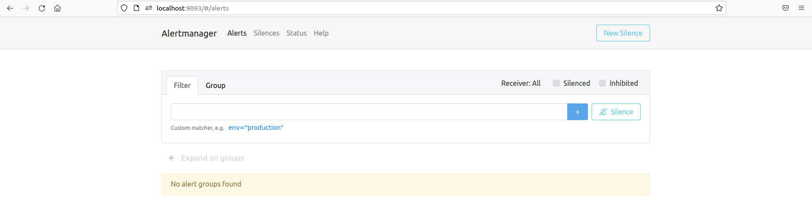

## Tabla de contenidos 

- [Requisitos previos](#Requisitos-previos)

- [Clonado del repositorio](#Clonado-del-repositorio)

- [Ejecución completa del proyecto](#Ejecución-completa-del-proyecto)

- [Ejecución únicamente de la aplicación Pastebin en local](#Ejecución-únicamente-de-la-aplicación-pastebin-en-local)
    
- [Ejecución y monitorización de la aplicación en local mediante Docker](#Ejecución-y-monitorización-de-la-aplicación-en-local-mediante-docker)

    - [Monitorización en Grafana](#Monitorización-en-Grafana)
    - [Notificaciones en Slack](#Notificaciones-en-Slack)

- [Despliegue de la aplicación Pastebin en AWS ELASTIC BEANSTALK](#Despliegue-de-la-aplicación-pastebin-en-AWS-ELASTIC-BEANSTALK)
    - [Monitorización de la aplicación Pastebin desplegada en AWS](#Monitorización-de-la-aplicación-Pastebin-desplegada-en-AWS)

- [Backup de la aplicación Pastebin en AWS S3](#Backup-de-la-aplicación-pastebin-en-AWS-S3)

- [Liberación de los recursos generados](#Liberación-de-los-recursos-generados)

- EXTRA: [Ejecución y monitorización de la aplicación en local mediante Kubernetes](#Ejecución-y-monitorización-de-la-aplicación-en-local-mediante-Kubernetes)

    - [Monitorización en Grafana K8s](#Monitorización-en-Grafana-K8s)
    - [Notificaciones en Slack K8s](#Notificaciones-en-Slack-K8s)


## Requisitos previos	

- Python 3.8 o superior
- Pip3
- Cuenta de GitHub
- Docker
- Docker-compose
- Cuenta de DockerHub
- Cuenta en AWS y credenciales configuradas en nuestra máquina
- AWS CLI
- EB CLI
- Terraform
- Cuenta de Slack

:information_source: Estos requisitos son solo para la parte `EXTRA`
- Minikube
- Kubectl 


## Clonado del repositorio

Para el clonado del repositorio solo es necesario realizarlo de la siguiente manera:

 ```
git clone git@github.com:KeepCodingCloudDevops6/practica-final-deadbycloud.git
```
 o bien,

```
git clone https://github.com/KeepCodingCloudDevops6/practica-final-deadbycloud.git
```


## Ejecución completa de proyecto

1. Nos situaremos dentro de la carpeta `/scripts`.

2. Debemos crear una variable de entorno con nuestro nombre de usuario de `DockerHub` mediante el siguiente comando:

    ```
    export DOCKERHUB_USER=NOMBREDEUSUARIO
    ```

3. Ejecutaremos el siguiente comando:

    ```
    ./autodeploy_all.sh
    ```

4. Se habrá desplegado la aplicación en local a través de docker, también en AWS y se habrá almacenado una copia de esta en un bucket S3.


## Ejecución únicamente de la aplicación Pastebin en local

1. Lo primero que debemos de hacer es situarnos en la carpeta de `flask-pastebin`.

2. Después deberemos de instalar todas las librerías con el siguiente comando:

    ```
    pip3 install -r requirements.txt
    ```

3. Por último, para poder ejecutar la aplicación lo haremos con el siguiente comando:
    ```
    python3 application.py
    ```

4. Nuestra terminal debería de devolvernos algo como:
    ```
    * Tip: There are .env or .flaskenv files present. Do "pip install python-dotenv" to use them.
    * Serving Flask app 'web' (lazy loading)
    * Environment: production
    WARNING: This is a development server. Do not use it in a     production deployment.
     Use a production WSGI server instead.
    * Debug mode: off
    * Running on http://127.0.0.1:5000/ (Press CTRL+C to quit)
    ```

5. Accediendo al enlace, podremos acceder a nuestra aplicación sin problemas.

6. Para ejecutar los tests lo hacemos con el siguiente comando:

    ```
    pytest
    ```

:information_source:
En la base de datos hay ya un usuario creado al que podemos acceder mediante las siguientes credenciales:

    Login: test

    Password: test123

:information_source:
También existe una URL específica `/admin` en la que podemos acceder a la base de datos desde la web.


## Ejecución y monitorización de la aplicación en local mediante Docker

1. Nos situaremos dentro de la carpeta `/scripts`.

2. Para poder ejecutar nuestra aplicación mediante docker, debemos crear una variable de entorno con nuestro nombre de usuario de `DockerHub` mediante el siguiente comando:

    ```
    export DOCKERHUB_USER=NOMBREDEUSUARIO
    ```

3. Cuando tengamos la variable de entorno establecida, ejecutaremos el siguiente comando:

    ```
    ./autodeploy_docker.sh
    ```

4. En este punto la aplicación al completo estaría arrancada y podríamos visualizarla mediante las siguientes URLs:

- Para abrir la aplicación `pastebin`:

    ```
    http://localhost:5000
    ```


- Para ver las métricas de la aplicación `pastebin`:    
    ```
    http://localhost:5000/metrics
    ```


- Para abrir `Prometheus`:
    ```
    http://localhost:9090
    ```


- Para abrir `AlertManager`:
    ```
    http://localhost:9093
    ```


- Para abrir `Grafana`:
    ```
    http://localhost:3000
    ```

## Monitorización en Grafana

1. Una vez abierto Grafana, nos pedirá usuario y contraseña, son los siguientes:
    ```
    username: admin
    password: admin
    ```
2. Una vez introducido, pulsaremos el boton `Skip`.

3. Estaremos en la página inicial de Grafana, el siguiente paso será acceder a `Data Sources` que se encuentra dentro del icono `Configuration` en el menú de la izquierda.

4. Una vez en el menú de `Data Source`, pulsaremos en el botón `Add Data Source` y seleccionaremos `Prometheus`.

5. En la sección `HTTP` modificaremos lo siguiente:
    ```
    URL: http://localhost:9090

    Access: Browser
    ```
    y pulsaremos el botón `Save & Test`.

6. Volveremos al menú de la izquierda y pulsaremos `Import` dentro del desplegable de `Create`.

7. Una vez en el menú de `Import` pulsaremos el botón `Upload JSON file` y seleccionaremos nuestro `custom_dashboard.json` que se encuentra en `/flask-pastebin/grafana` y pulsaremos `import`.

:information_source:Ya tendríamos configurado correctamente Grafana y podemos interactuar con nuestra app pastebin. Veremos como se actualizan los datos mostrados en nuestro dashboard en Grafana.


## Notificaciones en Slack

1. Para poder acceder a las notificaciones generadas en Slack, deberás pedir acceso con tu correo a los creadores de este proyecto.

2. Una vez seas admitido, entrando en la página oficial de slack, te aparecerá el canal `team-dead-by-cloud`, donde estarán disponibles todas las alertas generadas.

:information_source:Hemos creado alertas en Slack de uso excesivo de CPU y memoria. Podemos ver un ejemplo en la siguiente captura:


## Despliegue de la aplicación Pastebin en AWS Elastic Beanstalk

1. Nos situaremos dentro de la carpeta `/scripts`.

2. Ejecutaremos el siguiente comando:

    ```
    ./autodeploy_aws_app.sh
    ```

3. Verificaremos que la aplicación está desplegada en nuestra cuenta de AWS en el servicio de `Elastic Beanstalk`.


## Monitorización de la aplicación Pastebin desplegada en AWS

Para monitorizar nuestra aplicación ya desplegada en AWS Elastic BeanStalk, debemos:
    
1. Obtener la URL de nuestra APP en la nube. Sería algo similar a `flask-env.eba-6yqhpdyc.eu-west-1.elasticbeanstalk.com`

2. Modificar el fichero `/flask-pastebin/prometheus/prometheus.yaml` en la línea <b>13</b> y sustituir nuestra URL local por la URL de nuestra app de la nube, estableciendo el puerto 80. La línea 13 quedaría similar a la siguiente:    

    targets: ['flask-env.eba-6yqhpdyc.eu-west-1.elasticbeanstalk.com:80']

3. Modificar el fichero `/flask-pastebin/grafana/custom_dashboard.json` en las líneas <b>438</b> y <b>523</b> y de nuevo sustituir nuestra URL local por la URL de nuestra app de la nube, estableciendo el puerto 80. Las líneas 438 y 523 quedarían, respectivamente, casi idénticas a:

    "expr": "cpu_usage_percent{instance='flask-env.eba-6yqhpdyc.eu-west-1.elasticbeanstalk.com:80',job='flask-pastebin'}",

    "expr": "rate(memory_usage_bytes{instance='flask-env.eba-6yqhpdyc.eu-west-1.elasticbeanstalk.com:80',job='flask-pastebin'}[30s])/1000000",

4. Desplegar mediante el paso [Ejecución completa de la aplicación en local mediante Docker](#Ejecución-completa-de-la-aplicación-en-local-mediante-docker) comentado anteriormente y ya dispondríamos de nuestro Prometheus, AlertManager y Grafana apuntando a la aplicación alojada en AWS.


## Backup de la aplicación Pastebin en AWS S3 

1. Nos situaremos dentro de la carpeta `/scripts`.

2. Ejecutaremos el siguiente comando:

    ```
    ./autodeploy_backup_s3.sh
    ```
    
3. Comprobaremos que el backup de la aplicación está almacenado en nuestra cuenta de AWS en el servicio de S3.


## Liberación de los recursos generados

1. Nos situaremos dentro de la carpeta `/scripts`.

2. Ejecutamos el siguiente comando:

    ```
    ./autodelete_all.sh
    ```

3. Una vez ejecutado, volveremos a partir de cero.


## Ejecución y monitorización de la aplicación en local mediante Kubernetes

1. Nos situaremos dentro de la carpeta `/K8s`.

2. Para poder ejecutar nuestra aplicación mediante Kubernetes, debemos crear una variable de entorno con nuestro nombre de usuario de `DockerHub` mediante el siguiente comando:

    ```
    export DOCKERHUB_USER=NOMBREDEUSUARIO
    ```

3. Cuando tengamos la variable de entorno establecida, ejecutaremos el siguiente comando:

    ```
    ./autodeploy_k8s.sh
    ```

4. Abrimos una nueva pestaña en la terminal y realizamos un port-forward al servicio creado en nuestra aplicación Pastebin:

    ```sh
    kubectl -n app-k8s port-forward svc/app-service 5000:5000
    ```

5. Abrimos otra pestaña en la terminal y realizamos un port-forward del servicio de Prometheus:

    ```sh
    kubectl -n monitoring port-forward svc/prometheus-service 9090:9090
    ```

6. Abrimos otra pestaña en la terminal y realizamos un port-forward del servicio de AlertManager:

    ```sh
    kubectl -n monitoring port-forward svc/alertmanager-service 9093:9093
    ```

7. Abrimos una nueva pestaña en la terminal y realizamos un port-forward del servicio de Grafana:

    ```sh
    kubectl -n monitoring port-forward svc/grafana-service 3000:3000
    ```

8. En este punto la aplicación al completo estaría arrancada y podríamos visualizarla mediante las siguientes URLs:


- Para abrir la aplicación `pastebin`:

    ```
    http://localhost:5000
    ```

- Para ver las métricas de la aplicación `pastebin`:    
    ```
    http://localhost:5000/metrics
    ```

- Para abrir `Prometheus`:
    ```
    http://localhost:9090
    ```

- Para abrir `AlertManager`:
    ```
    http://localhost:9093
    ```

- Para abrir `Grafana`:
    ```
    http://localhost:3000
    ```

### Monitorización en Grafana K8s

1. Una vez abierto Grafana, nos pedirá usuario y contraseña, son los siguientes:
    ```
    username: admin
    password: admin
    ```
2. Una vez introducido, pulsaremos el boton `Skip`.

3. Estaremos en la página inicial de Grafana, el siguiente paso será acceder a `Data Sources` que se encuentra dentro del icono `Configuration` en el menú de la izquierda.

4. Una vez en el menú de `Data Source`, pulsaremos en el botón `Add Data Source` y seleccionaremos `Prometheus`.

5. En la sección `HTTP` modificaremos lo siguiente:
    ```
    URL: http://localhost:9090

    Access: Browser
    ```
    y pulsaremos el botón `Save & Test`.

6. Volveremos al menú de la izquierda y pulsaremos `Import` dentro del desplegable de `Create`.

7. Una vez en el menú de `Import` pulsaremos el botón `Upload JSON file` y seleccionaremos nuestro `grafana-dashboard.json` que se encuentra en `/K8s` y pulsaremos `import`.

:information_source:Ya tendríamos configurado correctamente Grafana y podemos interactuar con nuestra app pastebin. Veremos como se actualizan los datos mostrados en nuestro dashboard en Grafana.


### Notificaciones en Slack K8s

1. Para poder acceder a las notificaciones generadas en Slack, deberás pedir acceso con tu correo a los creadores de este proyecto.

2. Una vez seas admitido, entrando en la página oficial de slack, te aparecerá el canal `team-dead-by-cloud`, donde estarán disponibles todas las alertas generadas.

:information_source:Para liberar los recursos creados con Kubernetes ejecutamos:

```
minikube delete
```